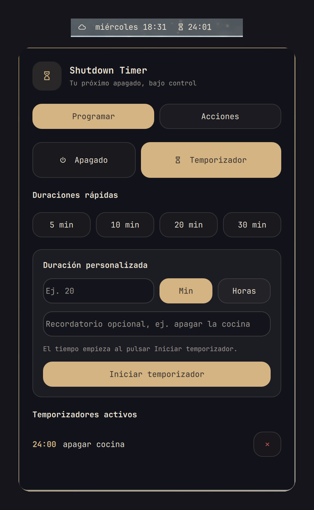

# Shutdown Timer



An [Omarchy](https://omarchy.org) bar plugin to **schedule a shutdown, run power actions, and set countdown timers with an optional reminder**. One popout hangs under its bar icon; an optional second instance shows a countdown clock in the center of the bar while something is running.

- **Actions** (instant): lock, log out, suspend, hibernate, restart, shut down. Destructive ones ask for confirmation.
- **Schedule → Shutdown**: shut down in 30 min, 1 h, 2 h or a custom time; extend or cancel it; a warning notification arrives before it happens.
- **Schedule → Timer**: several independent timers, each with an optional reminder such as "turn off the stove". A persistent notification and a sound fire when it ends.
- **Countdown clock** in the bar (`display: countdown`), hidden when nothing is running.
- A `shutdown-timer` CLI with `--dry-run`, and a test suite that never touches your real files.

## Install

Requirements: Omarchy 4.x, `systemd --user`, `jq`, `awk` and `notify-send`. Optional: `omarchy-notification-send` (themed notifications) and `paplay` (sound).

```bash
omarchy plugin add https://github.com/OmarGonD/omarchy-shutdown-timer.git --enable --yes
cd ~/.config/omarchy/plugins/io.github.omargond.shutdown-timer && ./install.sh
omarchy-restart-shell
```

`install.sh` does not use sudo. It copies the CLI to `~/.local/share/shutdown-timer/` and links it in `~/.local/bin` (or `$XDG_BIN_HOME`), and creates a default config if you have none. Nothing in your Omarchy or Hyprland configuration is changed. To get the countdown clock, add one entry yourself to `bar.layout.center` in `~/.config/omarchy/shell.json`:

```json
{ "id": "io.github.omargond.shutdown-timer", "display": "countdown" }
```

Update with `omarchy plugin update io.github.omargond.shutdown-timer --yes`, run `./install.sh` again and restart the shell.

## Remove

```bash
cd ~/.config/omarchy/plugins/io.github.omargond.shutdown-timer && ./uninstall.sh
omarchy plugin remove io.github.omargond.shutdown-timer --yes
```

This stops the plugin's systemd units and removes the CLI. Your config (`~/.config/shutdown-timer`) and logs (`~/.local/state/shutdown-timer`) are kept; delete them by hand to purge. If you added the countdown clock entry to `shell.json`, remove it there too.

## License

MIT. No external runtime dependencies beyond the tools listed above. The plugin runs unsandboxed inside the Omarchy shell.

---

# Español

Plugin nativo para Omarchy con identificador `io.github.omargond.shutdown-timer`.
Programa, consulta y cancela el apagado de la PC, ejecuta acciones de energía al
instante (bloquear, cerrar sesión, suspender, hibernar, reiniciar, apagar) y crea
temporizadores con aviso y recordatorio opcional, desde un popout bajo su icono de
la barra y desde la CLI `shutdown-timer`.

## Requisitos

- Omarchy 4.x con `manifest.json` versión 1.
- `systemd-run --user`, `systemctl --user`, `notify-send`, `jq` y `awk`.
  Opcionales: `omarchy-notification-send` y `paplay` (sonido).
- Una sesión gráfica activa con systemd-logind.

## Instalación y actualización

```bash
omarchy plugin add https://github.com/OmarGonD/omarchy-shutdown-timer.git --enable --yes
cd ~/.config/omarchy/plugins/io.github.omargond.shutdown-timer && ./install.sh
omarchy-restart-shell
```

`install.sh` es idempotente, no usa sudo y solo instala la CLI en
`~/.local/bin` (o `$XDG_BIN_HOME`) y crea la configuración predeterminada.
No modifica tu configuración de Omarchy ni de Hyprland.

Para actualizar un plugin instalado por Git:

```bash
omarchy plugin update io.github.omargond.shutdown-timer --yes
cd ~/.config/omarchy/plugins/io.github.omargond.shutdown-timer && ./install.sh
omarchy-restart-shell
```

## Menú y terminal

El widget de barra abre el panel. También puede abrirse con:

```bash
shutdown-timer menu
```

Ejemplos:

```bash
shutdown-timer 30m
shutdown-timer 45m
shutdown-timer 1h
shutdown-timer 4h
shutdown-timer status
shutdown-timer cancel
shutdown-timer schedule 2.5h
shutdown-timer logs
shutdown-timer --help
```

Se aceptan minutos y horas, incluyendo decimales en horas. El máximo es 168
horas. Se rechazan vacío, cero, negativos, letras, formatos inválidos y valores
mayores al máximo. Si ya existe un temporizador, la CLI permite reemplazarlo,
conservarlo o cancelar la operación (`--replace`, `--keep`, `--cancel`).

## Acciones, extender y cuenta regresiva

```bash
shutdown-timer --action reboot 1h     # poweroff (defecto), reboot, suspend, hibernate, lock, logout
shutdown-timer extend 30m             # suma tiempo al temporizador activo
shutdown-timer status                 # acción, restante y hora prevista
shutdown-timer status --short         # solo la cuenta regresiva (la usa el widget)
```

En el panel: `Alt+1`–`Alt+6` eligen la acción (Bloquear, Cerrar sesión, Suspender, Hibernar, Reiniciar, Apagar); `Hibernar` solo aparece si `omarchy-hibernation-available` lo permite. Programar cerrar sesión, reiniciar o apagar pide confirmación (`Enter` confirma, `Esc` cancela). Los botones «+15m/+30m/+1h» extienden el temporizador activo y el widget de barra muestra la cuenta regresiva.

## Temporizadores con aviso

Además del apagado, puedes crear temporizadores que solo avisan, con un recordatorio opcional. Pueden convivir varios y son independientes del apagado programado.

```bash
shutdown-timer timer 20m apagar la cocina   # avisa en 20 minutos
shutdown-timer timer 1.5h                   # sin mensaje: "Han pasado 1.5h"
shutdown-timer timers                       # lista los activos con el tiempo restante
shutdown-timer timer-cancel ID              # cancela uno (o "all" para todos)
```

Al vencer se muestra una notificación crítica que no desaparece sola (`-u critical -t 0`) y suena `alarm-clock-elapsed`. El aviso se muestra aunque `notifications=false`. En el panel están en **Programar → Temporizador con aviso**, con atajos de 5, 10, 20 y 30 minutos y la lista de activos con su cuenta regresiva y un botón ✕ para cancelarlos. Los temporizadores son unidades de systemd de usuario, así que no sobreviven a un reinicio del equipo (al volver a consultar la lista se limpian los vencidos).

## Reloj de cuenta regresiva en la barra

El widget admite varias instancias. Una segunda instancia con `display: countdown` muestra un reloj que **solo aparece mientras hay un temporizador o un apagado programado** y cuenta hacia el más próximo (`󰔟 19:42`, con `+N` si hay más; se pone en rojo el último minuto). Al pasar el ratón lista todos; al hacer clic abre el panel en Programar, colgado bajo el propio reloj.

Para añadirlo, agrega una entrada más en `bar.layout.center` (o la sección que prefieras) de `~/.config/omarchy/shell.json`:

```json
{ "id": "io.github.omargond.shutdown-timer", "display": "countdown" }
```

La instancia normal (`display: full`, por defecto) sigue siendo el botón que abre el panel; el panel vive en esa instancia, así que conviene mantenerla en la barra. Los widgets de la barra se cargan al iniciar el shell: tras actualizar el plugin ejecuta `omarchy-restart-shell`.

## Funcionamiento y seguridad

Se crean dos unidades transitorias de systemd de usuario: una avisa cuando faltan
`grace_period_seconds` (600 por defecto) y otra ejecuta la acción elegida
(`systemctl poweroff` por defecto) al alcanzar la hora prevista. No dependen de la terminal y no requieren sudo ni reglas sudoers.
La orden real está aislada en `poweroff_command()` para pruebas.

El estado y eventos se guardan en `$XDG_STATE_HOME/shutdown-timer`; la
configuración está en `$XDG_CONFIG_HOME/shutdown-timer/config.ini` y la
concurrencia se controla con `flock` sobre un archivo dentro del directorio de
estado (un proceso interrumpido no deja bloqueos colgados). El estado se escribe mediante archivo
temporal y `mv` atómico. Un estado vencido sin unidades activas se elimina.

Configuración predeterminada:

```ini
grace_period_seconds=600
notifications=true
maximum_hours=168
confirm_before_scheduling=true
confirm_before_canceling=false
```

Cancelar sigue siendo posible durante la ventana final:

```bash
shutdown-timer cancel
```

## Simulación

`--dry-run` nunca crea unidades reales ni llama a `systemctl poweroff`:

```bash
shutdown-timer --dry-run 30m
shutdown-timer --dry-run status
shutdown-timer --dry-run cancel
```

La salida muestra los nombres de unidades, la orden hipotética y marca el
estado como `SIMULACIÓN`.

## Desinstalación

```bash
cd ~/.config/omarchy/plugins/io.github.omargond.shutdown-timer && ./uninstall.sh
omarchy plugin remove io.github.omargond.shutdown-timer --yes
```

Se cancelan las unidades del plugin y se retira la CLI; configuración y logs se
conservan. Para purgarlos, elimínalos explícitamente después de revisar sus
rutas XDG.

## Pruebas y limitaciones

Las pruebas automatizadas (`bash tests/run-tests.sh`) usan un `HOME` y un `PATH`
falsos, con mocks de `systemd-run`, `systemctl`, `notify-send`,
`omarchy-notification-send` y `paplay`; nunca apagan el equipo ni tocan tus
archivos reales. El panel requiere que
`shutdown-timer` esté instalado en `PATH`. El plugin no puede garantizar que el
apagado continúe después de cerrar por completo la sesión de usuario si el
administrador de usuarios no permanece activo; durante la sesión gráfica
normal las unidades son independientes de la terminal.
